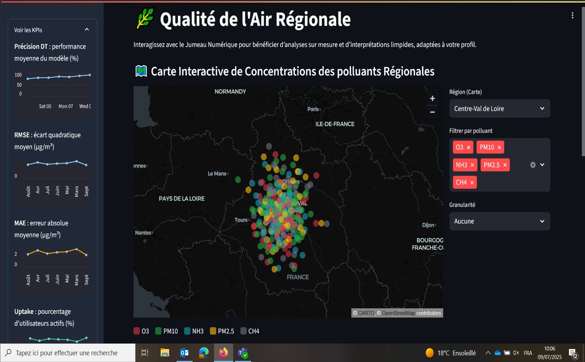
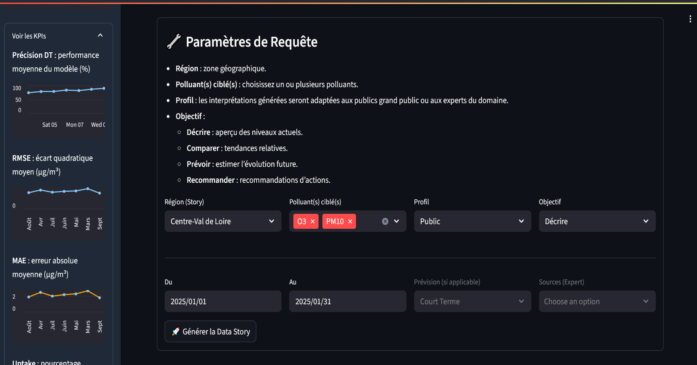
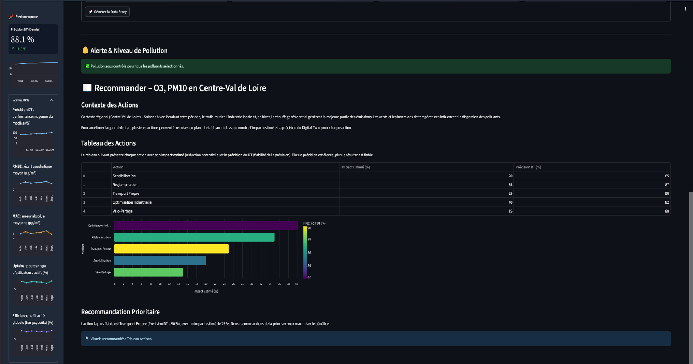
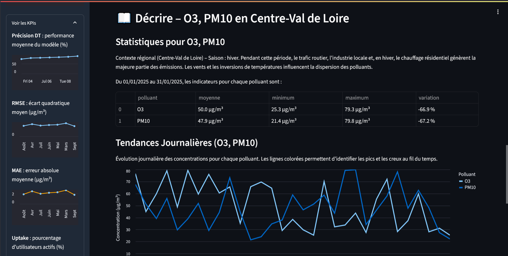

This project builds a Python-based web interface to demonstrate a modern digital twin model. It’s designed to simplify user interaction by capturing their needs and intentions, presenting results in an accessible way, and leveraging data‐storytelling. The included code uses simulated data to illustrate what a fully functional digital twin interface could look like.

