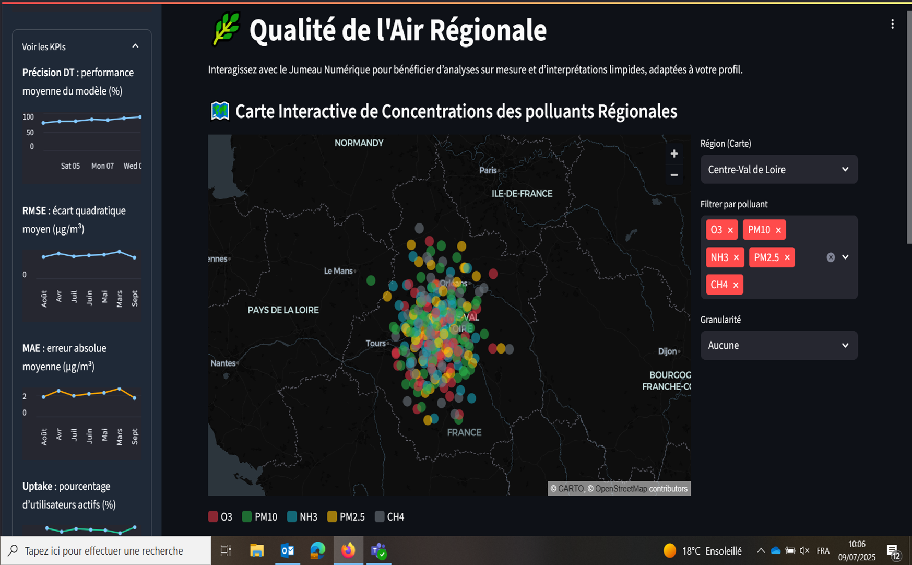
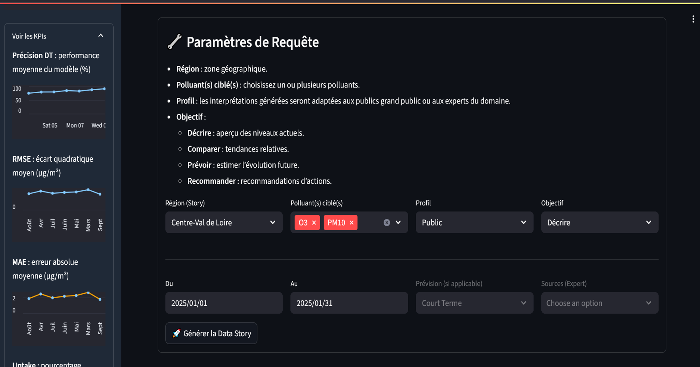
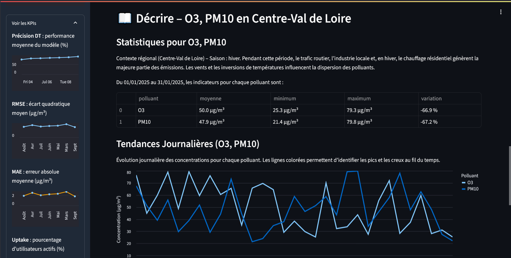
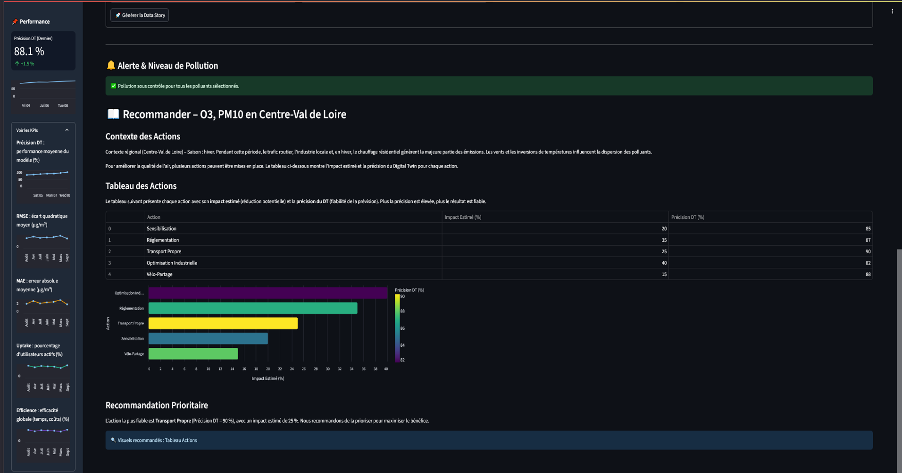

# Digital Twins — Jumeau numérique qualité de l'air

Interface web en Python qui démontre un jumeau numérique moderne : elle rapproche capteurs, données satellitaires et modèles pour explorer l'évolution de l'air, de l'eau et du climat sur un territoire.

Développé dans le cadre du programme JUNON (BRGM, 2025). Les données utilisées dans le notebook sont simulées et illustrent ce à quoi pourrait ressembler une interface de jumeau numérique pleinement fonctionnelle.

## Aperçu

## Ce que fait le projet

Le projet capture les besoins et intentions de l'utilisateur via une interface conversationnelle, présente les résultats de façon accessible avec une approche de data-storytelling, et illustre l'articulation entre capteurs, données satellitaires et modèles dans un même système.

## Contenu du dépôt

Le notebook `DT_air_preliminaire.ipynb` contient l'interface et la logique du jumeau numérique. Les fichiers `DT-air-requete.png`, `Dt-air-reponse.png`, `DT-air-reponse-recommand.png` et `DTair-ex-1.png` sont des captures d'écran de l'interface.

## Utilisation

Ouvrir `DT_air_preliminaire.ipynb` dans Jupyter ou Google Colab et exécuter les cellules dans l'ordre. Les données utilisées sont simulées à des fins de démonstration.
